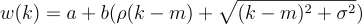

# Vol

A personal learning project on volatility, smile, surface, etc.

## Stochastic Volatility Inspired (SVI)

The SVI parameterization of the implied volatility smile was originally devised at Merrill Lynch in 1999
[by Jim Gatheral](https://papers.ssrn.com/sol3/papers.cfm?abstract_id=2033323).

k: log-moneyness  = ln(K/F)

w: total variance = IV^2 * T

Parameters:

* a: vertical shift (general variance)
* b: slope (tightness of smile)
* ρ: skew
* m: horizontal shift
* σ: ATM curvature

### Interactive Plot

To "feel" the SVI and its parameters, I created an intractive plot at [ghasimi.github.io/vol](https://ghasimi.github.io/vol/)